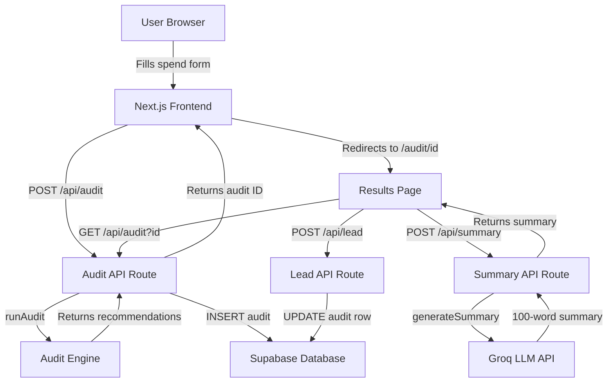

# Architecture

## System Diagram

## Data Flow

1. User fills the spend form on the homepage
2. On submit, `runAudit()` runs entirely client-side — pure TypeScript logic, no AI
3. The audit result and form data are sent to `POST /api/audit`
4. The API saves the audit to Supabase and returns the unique audit ID
5. User is redirected to `/audit/[id]`
6. The results page fetches the audit from Supabase via `GET /api/audit?id`
7. Simultaneously, it calls `POST /api/summary` which sends the audit to Groq
8. Groq returns a 100-word personalized summary (fallback to template if it fails)
9. User optionally submits email — stored in the same Supabase audit row

## Stack Choices

**Next.js 14 (App Router)** — Gives us React frontend and API routes in one project. No separate backend needed. Ideal for a solo build under time pressure.

**TypeScript** — Type safety caught several bugs during development, especially in the audit engine where pricing logic is critical.

**Supabase** — Hosted Postgres with a GUI, REST API, and RLS security. Faster to set up than raw Postgres on Render. Free tier is sufficient for this use case.

**Groq (Llama 3.3 70B)** — Free API with fast inference. The AI summary is a nice-to-have feature; Groq's free tier means zero cost during development and low cost at scale.

**Tailwind CSS + shadcn/ui** — Consistent, accessible components without a design system. Lets a solo developer ship polished UI fast.

**Vercel** — Zero-config deployment for Next.js. Automatic preview deployments on every push.

## Scaling to 10k Audits/Day

- Move audit engine to an edge function — it's pure computation with no I/O
- Add Redis caching for audit results — most shareable URLs are read-heavy
- Add a CDN for the Open Graph images
- Supabase free tier handles ~500 concurrent connections — upgrade to Pro at scale
- Rate limit the `/api/summary` route — Groq has rate limits on free tier
- Add a queue (e.g. Inngest) for summary generation so it doesn't block the UI